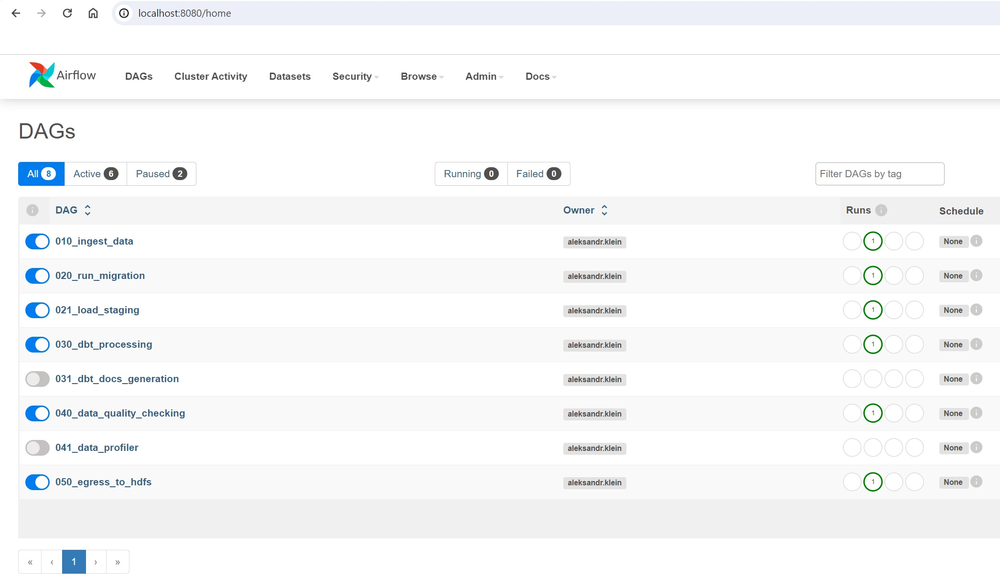
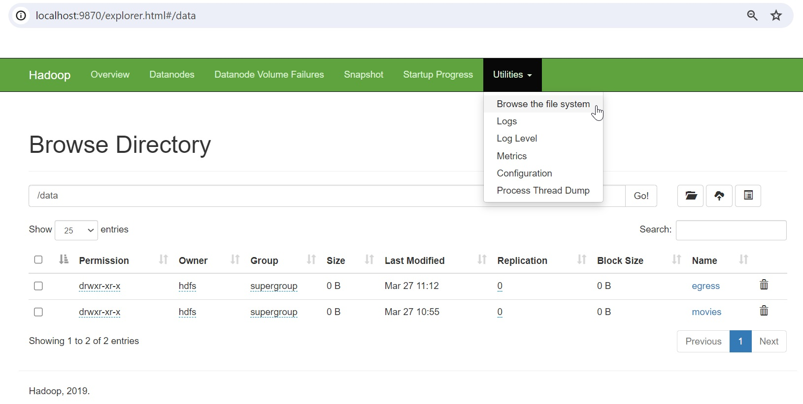
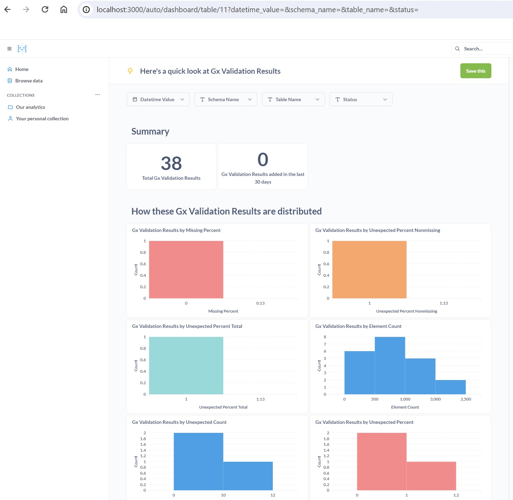

# Open-Source Data Platform Research Project

This research project aimed to build a data platform consisting exclusively of open-source tools. Through this exploration, I wanted to showcase my skills and share my fascinating journey through the data world. The platform's components reflect the entire data lifecycle, emphasizing data quality, transformation, and visualization.

## Components

- **Apache Airflow**: Orchestrates the data pipeline workflows.
- **Hadoop**: Distributed storage for handling large datasets.
- **PostgreSQL**: Serves as the data warehouse for storing and managing structured data.
- **Flyway**: Manages database schema changes and migrations through SQL scripts.
- **dbt**: Transforms data in the warehouse through SQL models.
- **Great Expectations**: Ensures data quality through profiling and validation.
- **Metabase**: Visualizes and analyzes data from the warehouse.
- **DataHub (Considered)**: For future metadata management and data lineage visualization.
- **Streaming Components (To be considered)**: To potentially incorporate real-time data processing.

## Airflow

As the scheduler I choose Airflow v2. You can get local access there using Access it locally at [this link](http://localhost:8080/home/). For login credentials, refer to [entrypoint.sh](./project/entrypoint.sh).

## Build and Run

When you need to start the app with all infrastructure, you have to make this steps:
1. Modify the environment variables in [env-file](./project/local.env) and [entrypoint.sh](./project/entrypoint.sh) (now there are default values).
2. Correct your credential files in the [YML-file](./project/docker-compose.yml).
3. Run the following: `docker-compose up -d --build` command. Give it some time. Your app, tables, and Airflow will soon be ready.
4. Monitor and trigger DAGs in [Airflow](http://localhost:8080/home).
5. Browse Hadoop storage at [Hadoop](http://localhost:9870/explorer.html#/).
6. Visualize data with [Metabase](http://localhost:3000).

## Data Pipelines

The data processing and transformation lifecycle are managed by the following Airflow DAGs:



### 1. Data Ingestion (`010_ingest_data`)

Ingests movie rating raw data into Hadoop's distributed file system.

### 2. Run Migrations (`020_run_migration`)

Applies database migrations to PostgreSQL to prepare the schema for the data warehouse.

### 3. Load Staging (`021_load_staging`)

Loads the ingested data into staging tables in the PostgreSQL data warehouse.

### 4. DBT Processing (`030_dbt_processing`)

Transforms the data in the staging area using dbt models to prepare it for analytics.

### 5. Data Quality Checking (`040_data_quality_checking`)

Performs data quality checks and validation using Great Expectations.

### 6. Egress to HDFS (`050_egress_to_hdfs`)

Exports transformed and validated data back to HDFS for further usage or archiving.

### Extra DAGs:

- `031_dbt_docs_generation`: Generates dbt documentation. More details can be found [here](https://github.com/AlexKlein/dbt_based_data_processing).
- `041_data_profiler`: Profiles data using Great Expectations. More details can be found [here](https://github.com/AlexKlein/dq_research_great_expectations/blob/master/readme.md).

## Hadoop Distributed File System

Browse the HDFS to see the raw and egressed data.



## Data Visualization with Metabase

Metabase dashboards provide insights and analytics from the data processed by the platform. Here's an example of a Metabase dashboard visualizing data quality validation results.



## Project Structure

- `airflow/`: Contains Airflow DAGs and plugins for orchestrating data workflows.
- `datahub/`: Credentials for Great Expectations to push validation results to Datahub.
- `dbt/`: Includes dbt models, a macros and profiles for data transformation.
- `great_expectations/`: Configuration and checks for data quality validation.
- `hadoop/`: Hadoop configuration and storage directories for NameNode and DataNodes.
- `metabase/`: Storage for Metabase internal database for persisting configurations.
- `migrations/`: SQL migration scripts for setting up and modifying the PostgreSQL schema.

## Database Migrations

[generate_migration.sh](./project/generate_migration.sh): A shell script used for generating generic SQL migration files. These files can be customized to include SQL statements for schema creation, table creation, permission grants, etc. It creates blank SQL files in the correct location with the appropriate file name template for use with Flyway.

## Database Tables

Explore the database tables used across the data platform:

```sql
select * from raw_data.metadata;
select * from raw_data.ratings;

select * from staging.metadata;
select * from staging.ratings;

select * from core_dwh.dim_category;
select * from core_dwh.dim_product;

select * from core_dwh.fact_product_category;
select * from core_dwh.fact_product_related_product;
select * from core_dwh.fact_rating;
select * from core_dwh.fact_sales_rank;

select * from dm_rating.top_bottom_five;
select * from dm_rating.top_five_increased_rating;

select * from data_quality.gx_validation_results;
```

## Future Enhancements with Datahub

Datahub is an advanced metadata platform that enables data discovery, data observability, and data governance. Integrating Datahub into our data platform would provide the following benefits:

- **Data Discovery**: Simplify finding datasets and understanding their lineage.
- **Data Observability**: Monitor the health of data through metadata such as freshness, volume, schema changes, and more.
- **Data Governance**: Implement governance standards across the data lifecycle.

### Great Expectations and Datahub

Great Expectations offers a feature that allows it to integrate with Datahub. With this integration, metadata from data validation performed by Great Expectations can be automatically ingested into Datahub. This provides a seamless experience for tracking data quality within the broader context of data governance and observability.

In this project Great Expectations is configured to push data validation results to Datahub:

```log
[2024-03-28, 09:58:20 UTC] {action.py:167} INFO - Sending metadata to datahub ...
[2024-03-28, 09:58:20 UTC] {action.py:168} INFO - Dataset URN - urn:li:dataset:(urn:li:dataPlatform:postgres,postgres.core_dwh.fact_rating,PROD)
[2024-03-28, 09:58:20 UTC] {action.py:171} INFO - Assertion URN - urn:li:assertion:103d8db2c97147b98e9f5261c10e4efc
```

This pushing of the metadata fails because there is no Datahub service in the project but it doesn't fail the whole DAG. I wanted just to configure this ability.

To disable this feature, clear the [action_list](https://github.com/AlexKlein/data_platform_research/blob/master/project/great_expectations/run_expectations_plugin.py#L122) parameter in [add_or_update_checkpoint()](https://github.com/AlexKlein/data_platform_research/blob/master/project/great_expectations/run_expectations_plugin.py#L102) within [the plugin](./project/great_expectations/run_expectations_plugin.py).

### Advantages of Great Expectations and Potential Datahub Integration

Great Expectations is a pivotal component in my data quality framework. It allows me to define expectations on our datasets—rules that my data should adhere to—which are critical for maintaining data integrity. These expectations can range from simple checks, like confirming that a column's values are unique, to complex ones, like validating the distribution of data in a column falls within a certain range.

#### Great Expectations: Data Quality Management

Further you can find examples of Data Quality improvement of using together Great Expectations and Datahub:

- Visualization of a list of Expectations
- Storing of Data Quality Check History
- Showing data health via Data Lineage

## Future Enhancements with Streaming Tools

Integrating a streaming tool like Kafka would allow me to process and analyze data in real-time, providing a robust solution for streaming analytics. This addition would enable the platform to handle high-throughput, scalable data pipelines and introduce complex event processing capabilities.

Kafka's addition would align with the platform's scalable nature, preparing it for more advanced real-time analytics and data-driven applications.

### Why Datahub and Kafka Are Not Yet Included

Currently, Datahub and Kafka are not part of this project due to its substantial resource requirements which may not be suitable for all environments, particularly those with limited computing capabilities. However, integrating these tools is seen as a strategic move for the future, offering a more comprehensive view and control over the entire data ecosystem and also have ability to make near real-time analytics.

The integration of Datahub and Kafka stands as a future development goal that would elevate the capabilities of this open-source data platform. By providing a central point to manage metadata, it would enhance visibility into data processes, improve collaboration between teams, and enable a more robust data governance framework.

## Conclusion

This platform is a testament to the power of open-source tools in creating a fully functional data ecosystem. Future expansions may include Datahub and streaming services or be explored in separate repositories.

## Troubleshooting

### standard_init_linux.go:228

If you encounter the error message **standard_init_linux.go:228: exec user process caused: no such file or directory** when running your Docker container, it may be due to an issue with the encoding of your [entrypoint.sh](./project/entrypoint.sh) file.

To resolve this issue, follow these steps:

1. **Check File Encoding:** Ensure that the [entrypoint.sh](./project/entrypoint.sh) file is encoded correctly. It should be in UTF-8.
2. **Correct Encoding Issues:** If you suspect encoding issues, you can use a text editor that allows you to change the file's encoding to UTF-8. Save the file with UTF-8 encoding, and then try running your Docker container again.
3. **Line Endings:** Verify that the line endings (Unix vs. Windows) in your [entrypoint.sh](./project/entrypoint.sh) file are appropriate for your platform. Use a text editor that allows you to convert line endings if necessary.
By following these steps, you can resolve the "no such file or directory" error related to the [entrypoint.sh](./project/entrypoint.sh) file encoding.
